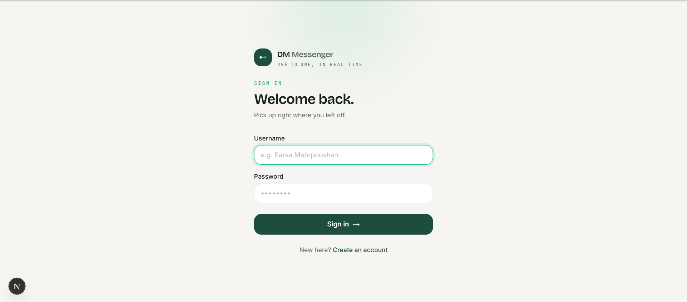
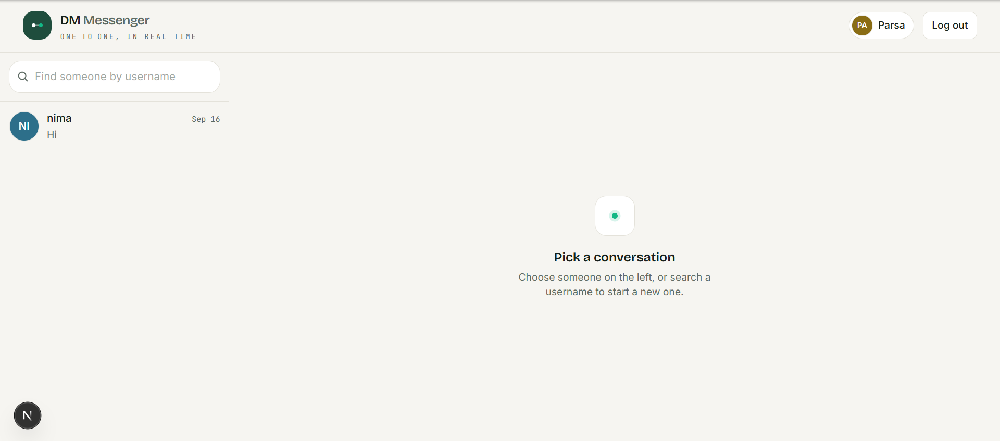
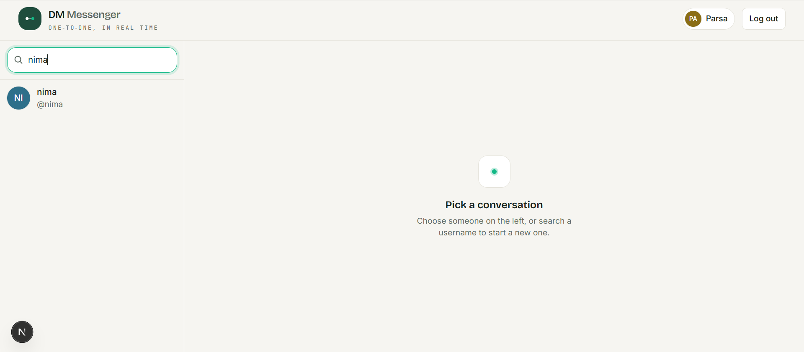
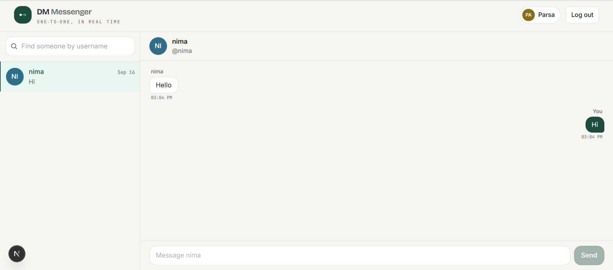
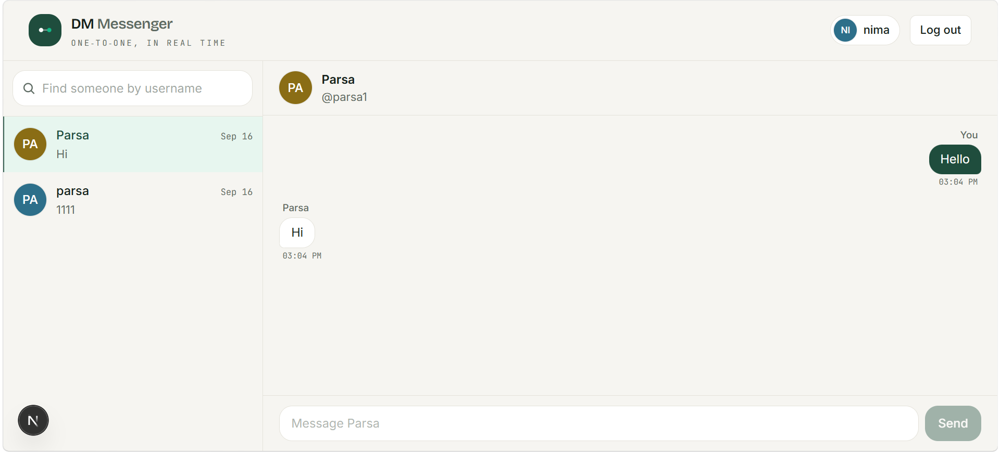
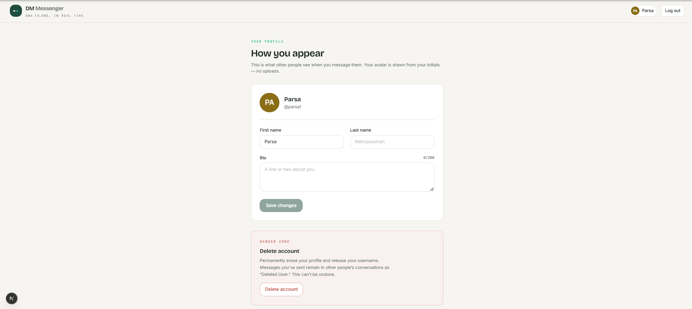

# DM Messenger

A minimal 1-on-1 realtime messenger (think: tiny Telegram) — username/password
auth, editable profiles, find people by username, instant chat over WebSockets,
and account deletion. Built as a learning project: every layer is hand-written
and understandable end to end (raw SQL, hand-rolled JWT, explicit Socket.IO
events).

The authoritative design lives in [`docs/`](docs/) — start with
[`docs/project.md`](docs/project.md) for the what/why and
[`docs/architecture.md`](docs/architecture.md) for the system design, data
model, and API contract.

📸 overview:









---

## Stack

- **client/** — Next.js (App Router) · TypeScript · Tailwind CSS · socket.io-client
- **server/** — Express · Socket.IO · better-sqlite3 (raw SQL) · JWT · bcrypt

Two independent Node processes. The client is UI-only; the server owns the
database, validation, and realtime fan-out. See [`docs/stack.md`](docs/stack.md).

## Prerequisites

- Node.js 22+ and npm (the server relies on Node's built-in `--env-file` flag)

## Setup

```bash
# Server
cd server
npm install
cp .env.example .env      # then set JWT_SECRET (the server won't start without it)

# Client
cd ../client
npm install               # .env.local (NEXT_PUBLIC_API_URL) is created for you
```

## Running (two terminals)

```bash
# Terminal 1 — API + WebSocket server on http://localhost:4000
npm run dev --prefix server

# Terminal 2 — web client on http://localhost:3000
npm run dev --prefix client
```

Health check: `curl http://localhost:4000/api/health` → `{"ok":true}`.

On first server start, `server/chat.db` is created automatically with the full
schema — no migrations, no manual setup.

## Useful commands

| What | Command |
|---|---|
| Run server (dev) | `npm run dev --prefix server` |
| Run client (dev) | `npm run dev --prefix client` |
| Type-check server | `cd server && npm run typecheck` |
| Build client (incl. type-check) | `npm run build --prefix client` |
| Reset all data | stop the server, delete `server/chat.db*`, restart |

## Project status

Built feature by feature in the order defined in
[`docs/features.md`](docs/features.md); completed work is logged in
[`docs/done.md`](docs/done.md). Current: **F0 — Scaffolding** complete.
